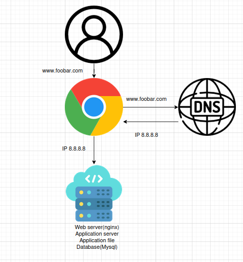

# Task 0 - Simple Web Stack

This diagram represents a basic one-server web infrastructure for the domain `www.foobar.com`.

## Diagram

---

## Infrastructure Explanation

### What is a server?
A server is a computer or system that provides resources, data, services, or programs to other computers, known as clients, over a network.

### What is the role of the domain name?
The domain name (like `foobar.com`) is a human-readable address used to reach a website. It maps to the IP address of the server where the website is hosted.

### What type of DNS record is `www` in `www.foobar.com`?
It is an **A record**, which maps the domain name to an IP address (in this case, `8.8.8.8`).

### What is the role of the web server?
The web server (Nginx) handles incoming HTTP requests from users. It serves static files or forwards the request to the application server.

### What is the role of the application server?
The application server executes the website’s code (business logic), processes requests, interacts with the database, and returns dynamic content.

### What is the role of the database?
The database (MySQL) stores, retrieves, and manages structured data for the web application.

### What is the server using to communicate with the user’s computer?
It uses **HTTP (or HTTPS)** over the **TCP/IP** protocol to communicate with the client (browser).

---

## Issues with This Infrastructure

### SPOF (Single Point of Failure)
If the only server goes down, the entire website becomes unavailable.

### Downtime during maintenance
Deploying new code or restarting the web server may cause temporary downtime.

### No scalability
This setup cannot handle a high volume of traffic since there is only one server handling all requests.
