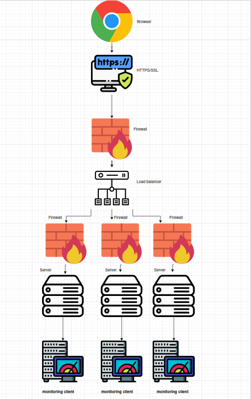

# Secured and Monitored Web Infrastructure 

---

##  Diagram

Suggested structure:
- Internet → Firewall 1 → Load Balancer (with SSL cert)
- Load Balancer → Firewall 2 → 3 Web/Application Servers
- Web/App Servers → Firewall 3 → Central MySQL Server
- Each Web/App Server also includes a Monitoring Client

---

##  Why Each Element Was Added

- **Firewall 1**:  
  Protects the Load Balancer from unauthorized internet access.

- **Firewall 2**:  
  Restricts and monitors traffic between the Load Balancer and backend servers (web/app servers).

- **Firewall 3**:  
  Secures access to the MySQL database, allowing only trusted internal traffic.

- **SSL Certificate**:  
  Enables HTTPS to encrypt traffic between users and www.foobar.com.  
  Prevents eavesdropping, man-in-the-middle (MITM) attacks, and builds user trust.

- **Monitoring Clients**:  
  Installed on each server to collect logs, metrics, and performance data.  
  They report to a centralized monitoring service (e.g., Sumologic, Datadog, Prometheus).

---

##  Purpose of Security and Monitoring Elements

- **Firewalls**:  
  Provide layered security by filtering unauthorized traffic and isolating network zones.

- **HTTPS (SSL/TLS)**:  
  Encrypts data in transit, ensuring secure communication between client and server.

- **Monitoring Tools**:  
  Help detect outages, abnormal behavior, high resource usage, and performance issues.  
  Enable real-time visibility and historical analysis.

- **How Monitoring Tools Collect Data**:  
  Monitoring agents run on each server and send logs and metrics to a central platform over a secure connection.  
  Data may include CPU, memory, disk usage, request/response times, and error logs.

- **Monitoring Web Server QPS (Queries Per Second)**:  
  - Enable HTTP access logs and web server metrics.  
  - Use a monitoring stack (e.g., Prometheus + Grafana or Sumologic dashboards).  
  - Create alerts when QPS exceeds normal thresholds.

---

## Issues With This Infrastructure

- **SSL Termination at the Load Balancer**:  
  - If HTTPS is terminated at the load balancer, internal traffic between LB and servers is unencrypted.  
  - If an attacker accesses the internal network, they can intercept traffic.  
  - Mitigation: Use TLS between Load Balancer and Backend servers (end-to-end encryption).

- **Single MySQL Server Accepting Writes**:  
  - Creates a Single Point of Failure (SPOF).  
  - If the master server crashes, writes are not possible until manual failover.  
  - Solution: Use MySQL replication with failover mechanisms or database clustering.

- **Servers with All Components (Web, App, DB)**:  
  - Poor separation of concerns and inefficient scaling.  
  - Increases complexity and risk of resource contention (CPU, memory).  
  - Better approach: Split roles into dedicated tiers (web, app, and database layers).

---

