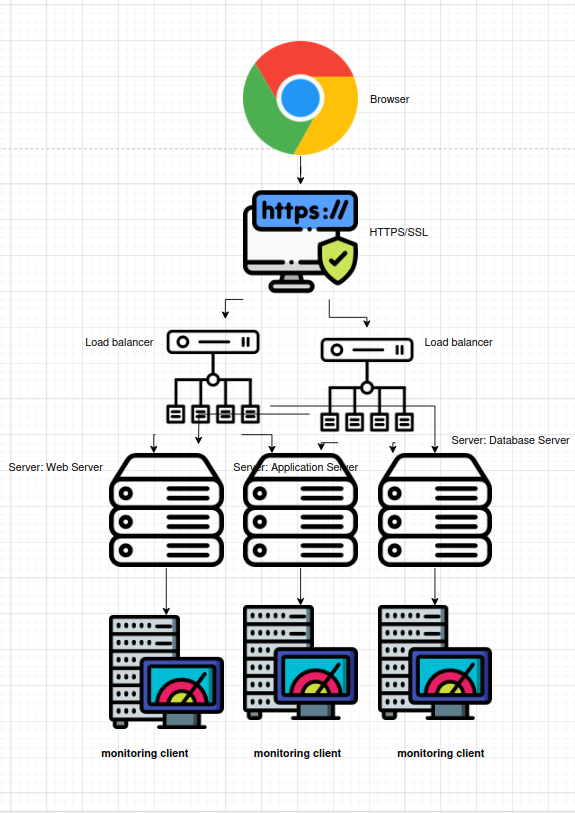

# Scaled Up Web Infrastructure

---

## Diagram 

---

##  Why Each Element Was Added

- **1 Additional Server**:  
  Improves availability and performance. More servers help handle more traffic.

- **HAProxy Cluster (2 Load Balancers)**:  
  Increases fault tolerance. If one load balancer fails, the other takes over.

- **Split Components**:  
  - **Web Server** (e.g., Nginx): Handles HTTP requests and static files.  
  - **Application Server** (e.g., Flask, Node.js): Runs business logic and dynamic content.  
  - **Database Server** (e.g., MySQL): Stores and manages data.  
  Splitting makes it easier to scale each part independently and improves resource usage.

---

## Web Server vs Application Server

- **Web Server**:  
  Delivers static files (HTML, CSS, images), handles basic HTTP requests.

- **Application Server**:  
  Processes application logic, runs code, interacts with the database.